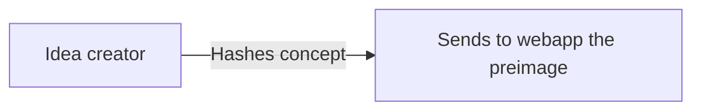
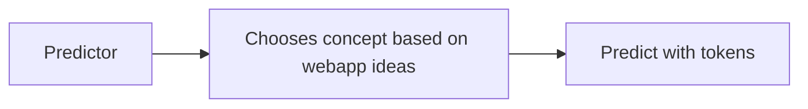
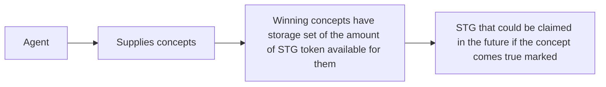
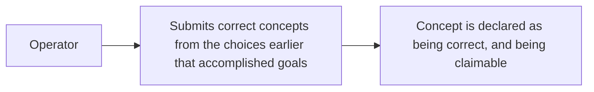
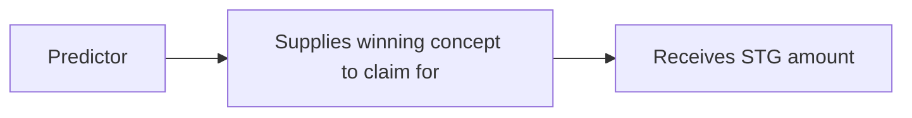

# Shahmeer's Game

This repo contains Shahmeer's Game, a quadratic voting game that will be played by members
of the Fluidity Money and Superposition community to suggest changes to 9lives on a weekly
basis.

|    Name   |                    Address                   |
|-----------|----------------------------------------------|
| SGT Token | `0xFDab24861F407765E6E64c282420585ef7cf68fe` |
| Impl      | `0x6a172c2115d88d1b2845fb2b2e9d8599efb307d3` |
| Proxy     | `0x9f98a61646eBF8C7c13394ad352C192eb90c740F` |
| Lens      | `0x5f8049771d5f2fb86Bf64d92C2511Eff10818f73` |

## Ideation

A user ideates a concept, and shares it with the contract. They do so to receive STG token
during the next dilution event.

## Voting

Users add votes to concepts they like. They do so by increasing their amount tracked as
allocated.

## Winners chosen

The operator supplies winning concepts to notify the contract that they were chosen for
inclusion in the next round of product features. In doing so, the users that ideated the
concepts have their claimable balances of STG tokens increased. Each winning concept is
marked as having a balance of STG that will be sent to the correct voters if it comes
true.

## Operator chooses winners that accomplished goal

The operator chooses winning concepts that accomplished the goal from the options that it
received earlier. In doing so, users who bet on that outcome are able to claim their share
of the pool of SGT tokens for the dilution event.

## Correct predictors draw down amount

Previous stage predictors draw down the concepts they voted on. In doing so, they receive
their share of the token dilution for each claimable section.

